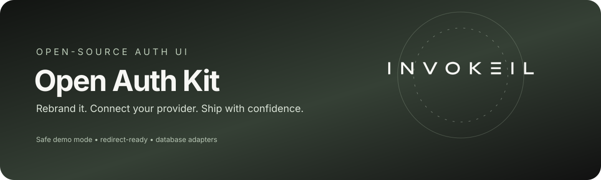

# Open Auth Kit Studio



A polished, open-source, rebrandable **React and TypeScript authorization UI** for teams that want a **safe local demo**, a **provider-agnostic OAuth/OIDC redirect boundary**, and a clean path to production integrations.

**Live demo:** [demoauth.invokeil.cfd](https://demoauth.invokeil.cfd/) · **Source:** [Invokeil/OPEN-AUTHKIT-STUDIO](https://github.com/Invokeil/OPEN-AUTHKIT-STUDIO)

[](LICENSE)
[](SECURITY.md)
[](package.json)
[](package.json)

> **Important:** this project is an authorization UI starter, not an identity provider. In demo mode, passwords are fake, local-only, and never persisted. In redirect mode, your server-side provider owns OAuth/OIDC, password handling, token exchange, sessions, and callbacks.

## Why this project?

| Capability          | Included                                                                                                                                      |
| ------------------- | --------------------------------------------------------------------------------------------------------------------------------------------- |
| Rebrandable UI      | Brand name, logo, accent, tagline, terms and privacy links are environment-driven.                                                            |
| Safe demo mode      | A complete animated sign-in/sign-up experience with fake `.test` credentials and no network submission.                                       |
| Redirect-ready mode | Redirect users to your own server-side login/signup or provider endpoint without collecting passwords in this UI.                             |
| Database boundary   | A small `UserStore` contract plus a memory adapter and implementation notes for Supabase, Firebase, PostgreSQL, SQLite, Cloudflare D1 and KV. |
| Security baseline   | Helmet headers, CSP, bounded request parsing, safe API 404s, strict static serving, secret scan and a reduced dependency graph.               |
| Maintainer-friendly | MIT license, English setup documentation, focused tests, reproducible lockfile and no committed dependencies.                                      |

## Contents

- [Quick start](#quick-start)
- [Step-by-step installation](#step-by-step-installation)
- [Demo credentials](#demo-credentials)
- [Branding and SVG logo](#branding-and-svg-logo)
- [Choose an auth mode](#choose-an-auth-mode)
- [Database integrations](#database-integrations)
- [Step-by-step editing guide](#step-by-step-editing-guide)
- [Project map](#project-map)
- [Security and upload hygiene](#security-and-upload-hygiene)
- [Testing and production build](#testing-and-production-build)
- [Troubleshooting](#troubleshooting)
- [Frequently asked questions](#frequently-asked-questions)
- [Suggested next improvements](#suggested-next-improvements)
- [License](#license)

## Quick start

```bash
git clone https://github.com/Invokeil/open-authkit-studio.git
cd open-authkit-studio
pnpm install
cp .env.example .env
pnpm dev
```

Open **http://localhost:3000**. The default page is a local demo and does not need a database, OAuth credential, API key, or third-party account.

<details>
<summary><strong>Step-by-step installation</strong></summary>

### 1. Install the prerequisites

Use Node.js 20 or newer and pnpm 10. The repository includes `pnpm-lock.yaml` so the dependency tree remains reproducible.

```bash
node --version
pnpm --version
```

### 2. Install dependencies locally

Dependencies are intentionally **not uploaded** to GitHub. Install them locally from the manifest and lockfile:

```bash
pnpm install --frozen-lockfile
```

### 3. Create your local environment file

```bash
cp .env.example .env
```

The example file contains only safe demo values. Keep `.env` private and never commit real secrets.

### 4. Start development mode

```bash
pnpm dev
```

The Vite development server listens on `localhost:3000`.

### 5. Verify the project

```bash
pnpm run check
pnpm test
pnpm run audit:secrets
pnpm run format:check
```

### 6. Build and run production output

```bash
pnpm build
NODE_ENV=production HOST=127.0.0.1 pnpm start
```

For a container or reverse proxy, set `HOST=0.0.0.0` and terminate TLS at the edge.

</details>

## Demo credentials

The default demo values are deliberately non-real:

| Field            | Demo value                     | Behavior                                                                 |
| ---------------- | ------------------------------ | ------------------------------------------------------------------------ |
| Email            | `demo@example.test`            | Local placeholder only                                                   |
| Password         | `demo-pass-1234`               | Local placeholder only; any non-empty password completes the visual demo |
| Database         | `memory`                       | No persistent user records                                               |
| Social providers | Google, GitHub, Discord, Apple | Local visual authorization state only                                    |

Do not replace these values with a real user account. Demo mode is for UI review, screenshots, QA and onboarding—not for production authentication.

## Branding and SVG logo

Set these values in `.env`:

```dotenv
VITE_BRAND_NAME=Your Product
VITE_BRAND_LOGO=/your-logo.svg
VITE_BRAND_TAGLINE=Secure access for every workspace.
VITE_BRAND_ACCENT=#3757C8
VITE_PRIVACY_URL=https://example.com/privacy
VITE_TERMS_URL=https://example.com/terms
```

Copy your logo to `client/public/your-logo.svg`. A safe logo should be a static, trusted SVG:

```xml
<svg xmlns="http://www.w3.org/2000/svg" viewBox="0 0 320 64">
  <path d="..." fill="#111111" />
</svg>
```

Use a valid `viewBox`, static paths, no scripts, no event handlers, no `<foreignObject>`, no remote images, no remote fonts and no JavaScript URLs. Prefer a high-contrast wordmark that remains legible at both desktop and mobile sizes. See the full SVG requirements in the English documentation in the repository.

## Choose an auth mode

### Demo mode — default

```dotenv
VITE_AUTH_MODE=demo
```

This mode is intentionally local-only. It provides the animated UI flow, fake credentials and provider buttons without sending passwords or creating accounts.

### Redirect mode — production integration boundary

```dotenv
VITE_AUTH_MODE=redirect
VITE_AUTH_LOGIN_URL=https://auth.example.com/login
VITE_AUTH_SIGNUP_URL=https://auth.example.com/signup
VITE_AUTH_PROVIDER_URL_GOOGLE=https://auth.example.com/oauth/google
VITE_AUTH_PROVIDER_URL_GITHUB=https://auth.example.com/oauth/github
```

Redirect mode does not implement your identity provider for you. Your server-side auth service must validate exact redirect URIs, `state`, PKCE, authorization codes, issuer/audience, token expiry and secure session cookies. Do not put client secrets, service-role keys or database URLs in `VITE_*` variables.

## Database integrations

The core UI does not require a database. The server exposes a small contract in `server/storage/types.ts`:

```ts
interface UserStore {
  getByEmail(email: string): Promise<UserRecord | null>;
  upsert(
    user: Omit<UserRecord, "createdAt" | "updatedAt">
  ): Promise<UserRecord>;
}
```

Supported integration targets:

| Provider      | Best fit                                                 | Secret/binding location                                    |
| ------------- | -------------------------------------------------------- | ---------------------------------------------------------- |
| Supabase      | Postgres-backed user profile data with RLS               | Server-only Supabase URL and service-role key              |
| Firebase      | Firestore profile records keyed by verified provider UID | Firebase Admin credential in the deployment secret manager |
| PostgreSQL    | Full control, migrations and relational constraints      | Server-only `DATABASE_URL`                                 |
| SQLite        | Single-node or self-hosted deployments                   | Server filesystem path outside the static directory        |
| Cloudflare D1 | Worker-native relational persistence                     | Worker `DB` binding                                        |
| Cloudflare KV | Cache/session/profile lookup with eventual consistency   | Worker `AUTH_KV` binding                                   |

Start with the detailed implementation guide:

```text
docs/DATABASES.md
```

The default factory fails closed when an external provider is selected without a real adapter. This avoids showing a misleading “connected” state.

## Step-by-step editing guide

### Change the brand without touching React code

1. Copy `.env.example` to `.env`.
2. Set `VITE_BRAND_NAME`, `VITE_BRAND_LOGO`, `VITE_BRAND_TAGLINE` and `VITE_BRAND_ACCENT`.
3. Put the trusted SVG under `client/public/`.
4. Restart `pnpm dev` because Vite reads environment variables at startup.

### Change text, flow or providers

Edit `client/src/pages/Home.tsx`. The main areas are:

| Area                                  | File or symbol                                                             |
| ------------------------------------- | -------------------------------------------------------------------------- |
| Brand and public config               | `client/src/config.ts`                                                     |
| Sign-in/sign-up copy and validation   | `client/src/pages/Home.tsx`                                                |
| Provider list                         | `VITE_AUTH_PROVIDERS` in `.env`                                            |
| Redirect logic                        | `redirectToConfiguredAuth()` in `client/src/config.ts`                     |
| Colors, spacing and responsive layout | `client/src/index.css`                                                     |
| 404 and error fallback                | `client/src/pages/NotFound.tsx`, `client/src/components/ErrorBoundary.tsx` |

### Add a real database adapter

1. Implement `UserStore` in `server/storage/`.
2. Normalize email and enforce a unique constraint.
3. Use parameterized queries or the provider SDK.
4. Keep all provider keys server-side.
5. Register the adapter in `server/storage/index.ts`.
6. Add a unit or integration test.
7. Run `pnpm check`, `pnpm test`, `pnpm run audit:secrets` and `pnpm build`.

### Change the visual theme

Edit the CSS custom properties at the top of `client/src/index.css`. Keep `prefers-reduced-motion`, `:focus-visible`, mobile breakpoints and contrast behavior intact when changing the aesthetic.

## Project map

```text
client/
  public/logo.svg          # Retained demo SVG
  src/config.ts            # Public branding and auth-mode configuration
  src/pages/Home.tsx       # Animated authorization UI
  src/index.css            # Design tokens and responsive layout
server/
  index.ts                 # Hardened Express static server
  storage/                 # Database contract and memory adapter
docs/
  DATABASES.md             # Provider-specific implementation guide
  hero.svg                 # Safe animated README hero
scripts/
  scan-secrets.mjs         # Upload/release secret scan
tests/
  storage.test.ts          # Contract tests
.env.example               # Safe public configuration template
SECURITY.md                # Security policy and production checklist
AUDIT_REPORT.md            # Full source audit report
```

## Security and upload hygiene

Before publishing or deploying:

```bash
pnpm run audit:secrets
pnpm audit --prod
```

Never upload `node_modules`, `dist`, `.env`, real OAuth secrets, service-role keys, database URLs, private keys, customer data or deployment metadata. If a credential ever enters Git history, revoke/rotate it in the provider dashboard; deleting the file alone is not enough.

Read [`SECURITY.md`](SECURITY.md) before enabling redirect mode and [`AUDIT_REPORT.md`](AUDIT_REPORT.md) for the original risk analysis and remediation record.

## Testing and production build

| Command                  | Purpose                                 |
| ------------------------ | --------------------------------------- |
| `pnpm dev`               | Start local Vite development server     |
| `pnpm run check`         | TypeScript validation                   |
| `pnpm test`              | Run unit tests                          |
| `pnpm run audit:secrets` | Scan for common secret patterns         |
| `pnpm audit --prod`      | Check production dependency advisories  |
| `pnpm build`             | Build browser bundle and Express server |
| `pnpm start`             | Run the built server                    |
| `pnpm run format:check`  | Verify formatting                       |

## Troubleshooting

<details>
<summary><strong>The logo is not visible</strong></summary>

Confirm that the file exists at `client/public/your-logo.svg`, that `VITE_BRAND_LOGO=/your-logo.svg` starts with `/`, and restart Vite after changing `.env`.

</details>

<details>
<summary><strong>Redirect mode shows a configuration error</strong></summary>

Set `VITE_AUTH_LOGIN_URL` for sign-in and `VITE_AUTH_SIGNUP_URL` for sign-up. For provider-specific buttons, set `VITE_AUTH_PROVIDER_URL_GOOGLE`, `VITE_AUTH_PROVIDER_URL_GITHUB`, and similar variables. Use HTTPS outside localhost.

</details>

<details>
<summary><strong>Why does an external database provider fail at startup?</strong></summary>

The repository includes the contract and docs, but it does not silently pretend that a provider is connected. Implement the provider adapter in `server/storage/`, register it in the factory, add tests, then set `DATABASE_PROVIDER`.

</details>

## Frequently asked questions

### What is Open Auth Kit Studio?

Open Auth Kit Studio is an open-source, rebrandable React and TypeScript authorization UI starter. It provides a polished sign-in and sign-up interface, safe local demo mode, a provider-agnostic redirect boundary, SVG branding configuration, and database adapter guidance.

### Is this a real OAuth or identity provider?

No. Demo mode is a local UI demonstration and does not verify real credentials, create accounts, or persist sessions. Redirect mode hands authentication to your own server-side OAuth/OIDC service, which must implement callback validation, PKCE, secure sessions, logout, and provider-specific controls.

### Can I use my own logo and brand name?

Yes. Set `VITE_BRAND_NAME`, `VITE_BRAND_LOGO`, `VITE_BRAND_TAGLINE`, and `VITE_BRAND_ACCENT` in `.env`, then place a trusted static SVG in `client/public/`. The SVG must not contain scripts, event handlers, remote resources, or JavaScript URLs.

### Which databases can I integrate?

The repository includes a provider-agnostic `UserStore` contract and guidance for Supabase, Firebase Firestore, PostgreSQL, SQLite, Cloudflare D1, and Cloudflare KV. Database credentials must remain server-side, and an adapter must be implemented before selecting a non-memory provider.

### Where can I try the demo?

Use the public demo at [demoauth.invokeil.cfd](https://demoauth.invokeil.cfd/), or run it locally with `pnpm install`, `cp .env.example .env`, and `pnpm dev`.

## Suggested next improvements

For a production-ready product, the highest-value next steps are a server-side OAuth/OIDC callback service with PKCE and secure sessions, provider integration tests using ephemeral environments, a migration CLI, rate limiting, structured redacted logging, backup/restore automation and a deployment example for your chosen platform. Keep demo mode separate from production mode so future changes cannot accidentally turn a visual mock into an unsafe credential collector.

## License

MIT. See [`LICENSE`](LICENSE).

## References

[1]: https://datatracker.ietf.org/doc/html/rfc7636 "RFC 7636: Proof Key for Code Exchange by OAuth Public Clients"
[2]: https://supabase.com/docs/guides/database/postgres/row-level-security "Supabase Row Level Security"
[3]: https://firebase.google.com/docs/admin/setup "Firebase Admin SDK setup"
[4]: https://node-postgres.com/features/queries "node-postgres parameterized queries"
[5]: https://developers.cloudflare.com/d1/worker-api/ "Cloudflare D1 Worker API"
[6]: https://developers.cloudflare.com/kv/api/ "Cloudflare KV Binding API"
